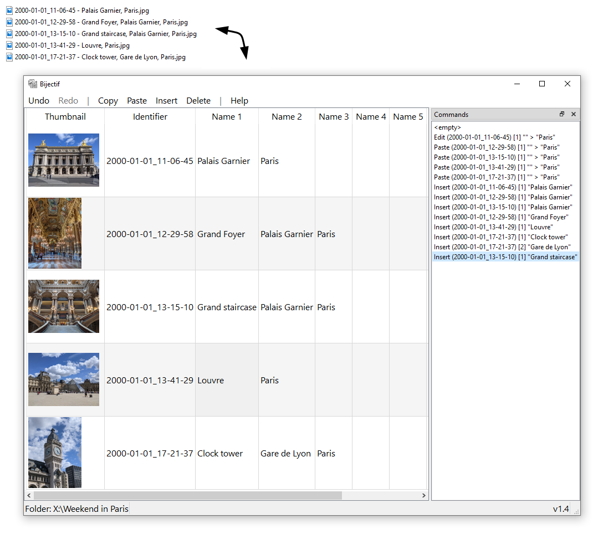

# Bijectif &mdash; Image titles in filenames



## Build

### Arch Linux

Use `PKGBUILD`.

### Debian

```
sudo apt install cmake make g++ qt6-base-dev qt6-l10n-tools qt6-multimedia-dev qt6-tools-dev
cmake -DCMAKE_BUILD_TYPE=Release . -B build
cmake --build build
```

### Windows

Use `build-msys2.sh` in [MSYS2](https://www.msys2.org/) UCRT64 environment.

## License

This project is licensed under the terms of the GNU General Public License v3.0. See `LICENSE`.
